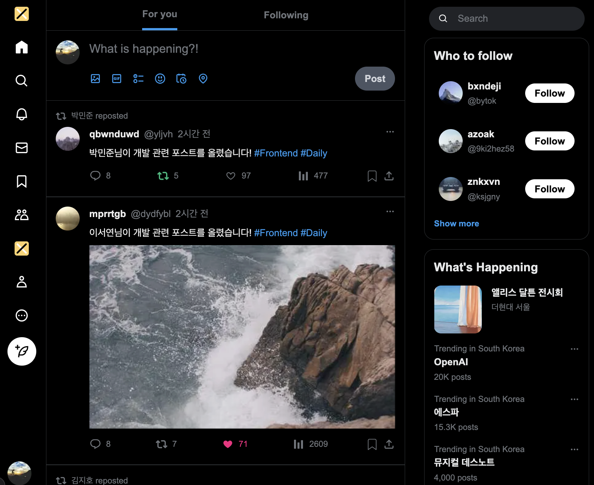

# 🐦 소셜 미디어 피드 프론트엔드 개발 과제

이미지와 함께 더 자세한 설명을 작성해놓은
Notion 페이지

: <https://mica-wildflower-3c1.notion.site/29244c7e1a56800f9c09eda1115f6e54?source=copy_link>

<br>



<br>

## 🚀 실행 방법

```
npm install
npm run dev
```

<br>

## 🛠️ 사용한 기술 스택 및 선택 이유

- Next.js (App Router)

- App Router 구조로 라우팅과 레이아웃 관리가 간결

- 최적화 및 초기 렌더링 속도 우수

- 서버 컴포넌트와 클라이언트 컴포넌트를 명확히 분리 가능

- Zustand

  전역 상태 관리 라이브러리로 Redux보다 가볍고 보일러플레이트가 거의 없어서 이용

  React 훅 기반으로 직관적인 사용 가능

  북마크, 좋아요, 리트윗 같은 상태를 저장하기 위한 localStorage와 연동 용이

- mockApi.ts

  데이터베이스를 사용하지 않았지만, mockApi.ts와 localStorage를 활용해 실제 서비스처럼 데이터가 저장되어 작동됨

- Intersection Observer
  스크롤 위치 감지로 무한 스크롤 구현

- TypeScript

  타임 오류를 미리 방지 및 컴포넌트 간 Props 타입 안정성 확보

- Tailwind CSS

  CSS 모듈 관리 불필요하고 직관적인 클래스 네이밍으로 유지보수 용이

<br>

## ✅ 구현한 기능 목록

1. 메인 피드 화면 구현

   1-1. 게시물 리스트 (/)

   - 무한 스크롤 또는 페이지네이션으로 게시물 목록 표시

     15개 게시물을 먼저 표시하고 스크롤을 내리면 스피너가 보이다가 다음 게시물들을 보여주고, 모든 게시물을 보여줬으면 텍스트 표시

   - 각 게시물 카드에 포함될 정보:

     - 작성자 정보 (프로필 이미지, 이름, 사용자명)

       X처럼 사용자명과 ID를 표시했습니다.

     - 게시물 내용 (텍스트, 이미지)

       텍스트/이미지 따로, 텍스트/이미지 같이 모두 게시 가능합니다.

     - 작성 시간 (상대적 시간: "3분 전", "1시간 전")

       1분 이내는 “방금 전”으로 표시되고, “~분 전, ~시간 전”으로 표시됩니다.

       ex) 더미데이터 중 샘플 1~2는 “2년 전”으로 표시가 잘 되고 있습니다.

     - 상호작용 버튼 (좋아요, 리트윗, 댓글 수)

       더미데이터에 주어진 샘플 게시물 2개 이외에 3~50개까지는 랜덤으로 게시물을 생성해서 더미데이터에 주입하여 피드에 보여줍니다. 그리고 새로고침을 하거나 페이지 이동했다가 다시 홈 피드로 돌아와도 댓글/리트윗/좋아요 수는 저장이 됩니다.

       Profile 메뉴로 이동 시 현재 사용자의 프로필이 보입니다.

       사용자 프로필 화면은 Posts탭을 기본으로 볼 수 있는데
       Posts탭에서는 사용자가 쓴 게시물과 사용자가 리트윗을 누른 게시물을 볼 수 있습니다.

       Likes 탭에서는 사용자가 좋아요를 누른 게시물들을 볼 수 있습니다.

   1-2. 게시물 작성 (/compose)

   - 게시물 작성 모달 또는 별도 페이지

     홈 피드와 별도 모달 페이지에서 게시물 작성 가능

   - 텍스트 입력 (최대 280자 제한)

     텍스트 입력시에 280자를 100% 기준으로 글자수를 보여주고, 280자 초과 시에는 빨간색으로 경고 표시

   - 이미지 첨부 기능 (미리보기 포함)

     이미지만 첨부하거나 이미자와 텍스트 혼합으로 게시물 작성 가능

     Zustand를 사용했기 때문에 저장되어서 새로고침하거나 프로필 페이지로 이동하면 현재 사용자가 작성한 게시물을 볼 수 있습니다.

   * 실시간 글자 수 카운터

     280자를 100%로 하여 실시간 글자수 카운터와 함께 퍼센테이지 현황을 볼 수 있음

   * 작성 완료 후 피드에 새 게시물 반영

     Zustand를 이용하여 상태를 저장했기 때문에 홈 피드에 새 게시물 작성한 것이 반영되고 프로필 페이지로 이동해도 확인 가능

2. 상호작용 기능

   2-1. 좋아요 시스템

   - 게시물별 좋아요 버튼 (하트 아이콘)

     게시물별로 좋아요를 누르면 저장이 되어서 새로고침 또는 페이지 이동을 해도 같은 좋아요 수를 볼 수 있음

     좋아요를 클릭 시 텍스트와 하트 아이콘 내부도 빨간색으로 칠해짐

     프로필 페이지의 Likes탭에서 좋아요한 게시물들만 보기 가능

   - 클릭 시 애니메이션 효과 및 카운트 증가/감소

     좋아요 버튼을 클릭 시 애니메이션 효과가 있으며 숫자가 위로 슬라이드되며 변경됨

     좋아오 취소 시 숫자가 아애로 슬라이드되며 하트 색이 없어짐

   - 낙관적 업데이트 (즉시 UI 반영 후 서버 동기화)

     완료

   - 리트윗, 좋아요, 북마크를 누르면 즉시 UI에 반영됨
     완료

<br>

## 💡 추가 구현한 기능

1. UX개선

- 스켈레톤 로딩 적용

  우측 메뉴 중 Who to follow에서 로딩 시 스켈레톤 로딩 적용

- 게시물 북마크 기능

  완료

2. 기술적 개선

- TypeScript 적용

  완료

- Jest + Testing Library 테스트

  5개 테스트 PASS

3. 고급 기능

- 이미지 lazy loading

  완료

- 텍스트 하이라이팅 (해시태그, 멘션)

  완료

<br>

## 💡 기타 추가한 것들

- 더미데이터가 3~50까지는 랜덤으로 게시물을 생성했음

- 다른 게시물 작성자의 id가 없어서 더미데이터에 추가함

- 더미데이터에서 통계 숫자도 추가함

  : 통계는 랜덤 숫자로 더미데이터에 주입하여 피드에 표시됨

* Profile페이지
* 게시물 작성 시 이미지 크기 수정하여 피드에 반영 가능

* Who to follow 에서는 더미데이터 중 무작위로 3명의 사람을 추천

* 이미지 로딩 시 블러 효과로 부드럽게 트랜지션 효과

* 구현 안 한 페이지에 대하여 404페이지 생성

<br>

## 🤔 기술적 고민과 해결 과정

- 스크롤 시 피드와 우측 메뉴가 함께 스크롤되고 길이가 짧은 섹션이 먼저 멈추게 해야 하는 문제

  : 무한 스크롤을 하니까 RightBar의 마지막부터 빈 공간이 무한으로 생겨서 어려움이 있었습니다.

  RightBar에 보이지 않는 별도 스크롤을 두고 숨김처리했습니다.

* 홈 피드에서 무한 스크롤 기능 문제

  : 해본 적이 없어서 어려운 기능이었습니다.

  Zustand를 사용했고 게시물의 정보를 저장할 수 있는 store 폴더를 만든다음 보여줘야 하는 전체 게시물 중에서 15개를 먼저 보여주고 스크롤하면

  그 다음 15개를 보여주는 방식으로 했습니다.

* 타사용자의 프로필 페이지에서 커버이미지가 한참 늦게 뜨는 문제

  : 더미데이터에도 커버이미지를 추가하고 이미지 로딩 시에는 블러였다가 천천히 블러를 걷어내는 트랜지션을 추가하여 부드럽게 표시했습니다.

  프로필 페이지의 커버이미지랑 홈 피드의 이미지에도 적용했습니다.
